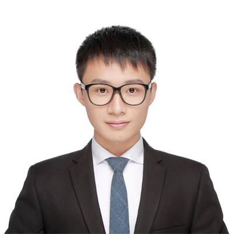

# Qingyang Yuan 袁庆洋
<canvas width="300" height="300" id="myCanvas"></canvas>
<html>
	<head>
		<meta charset="utf-8" />
	</head>
	<body>

<table>
	<tbody>
		<tr>
			<td width="670">
				<h3>Master</h3>
			  

					School of Reliability and Sestems Engineering 
					Beihang University  
          XueYuan Road No.37  
          HaiDian District,BeiJing, 100191  
          China  
           
				Email: tsyoung.yuan@buaa.edu.cn

			<td>
				 
				</td>
		<tr>
	</tbody>
</table>
<h2>Biography</h2>

  I'm a PhD student in <a href="http://learning.cs.toronto.edu/">Machine Learning Group</a>, Department of Computer Science, University of Toronto. My advisors are Prof. <a href="http://www.cs.toronto.edu/~urtasun/">Raquel Urtasun</a> and Prof. <a href="http://www.cs.toronto.edu/~zemel/inquiry/home.php">Richard Zemel</a>. I'm also a Researcher in <a href="https://www.uber.com/info/atg/">Uber Advanced Technology Group</a> Toronto, lead by Prof. <a href="http://www.cs.toronto.edu/~urtasun/">Raquel Urtasun</a>. I received M.Phil. degree from Department of Computer Science and Engineering, Chinese University of Hong Kong, under the supervision of Prof. <a href="http://www.cse.cuhk.edu.hk/~leojia/">Jiaya Jia</a>. I got B.Eng. degree from School of Automation Science and Electrical Engineering in Beihang University (former Beijing University of Aeronautics and Astronautics). I've had the good fortune of working with some smart "<a href="./coworkers.html">neural networks</a>". 

My research interests include machine learning and computer vision.

<h2>Recent Publications (<a href="http://scholar.google.com/citations?user=2wrS35MAAAAJ&hl=en&oi=ao">Google Scholar</a>)</h2>
<ul>
  <li>
    <a href="./papers/iccv_2017_3DGNN.pdf">3D Graph Neural Networks for RGBD Semantic Segmentation, </a>
    Xiaojuan Qi, <b>Renjie Liao</b>, Jiaya Jia, Sanja Fidler, Raquel Urtasun 
    <em>IEEE International Conference on Computer Vision</em> (<b>ICCV</b>), 2017. <b>[Oral]</b>  
    

  </li>
  <li>
    <a href="./papers/iccv_2017_situation.pdf">Situation Recognition with Graph Neural Networks, </a>
    Ruiyu Li, Makarand Tapaswi, <b>Renjie Liao</b>, Jiaya Jia, Raquel Urtasun, Sanja Fidler 
    <em>IEEE International Conference on Computer Vision</em> (<b>ICCV</b>), 2017.  
    

  
  </li>

  <li>
    <a href="./papers/iccv_2017_detail_SR.pdf">Detail-revealing Deep Video Super-Resolution, </a>
    Xin Tao, Hongyun Gao, <b>Renjie Liao</b>, Jue Wang, Jiaya Jia 
    <em>IEEE International Conference on Computer Vision</em> (<b>ICCV</b>), 2017. <b>[Oral]</b>  
    

      [<a href="https://github.com/jiangsutx/SPMC_VideoSR">Code</a>]
    
      
  </li>

  <li>
    <a href="./papers/arXiv_2016_Normalization.pdf">Normalizing the Normalizers: Comparing and Extending Network Normalization Schemes, </a>
    Mengye Ren*, <b>Renjie Liao*</b>, Raquel Urtasun, Fabian H. Sinz, Richard S. Zemel 
    <em>International Conference on Learning Representations</em> (<b>ICLR</b>), 2017.  
    

      [<a href="https://github.com/renmengye/div-norm">Code</a>]
    

  </li>

  <li>
    <a href="./papers/NIPS_2016_Parsimonious.pdf">Learning Deep Parsimonious Representation, </a>
    <b>Renjie Liao</b>, Alexander Schwing, Richard S. Zemel, Raquel Urtasun. 
    <em>Neural Information Processing Systems</em> (<b>NIPS</b>), 2016.   
    

      [<a href="https://github.com/lrjconan/deep_parsimonious">Code</a>]
    

  </li>

  <li>
    <a href="./papers/ICCV_2015_Video.pdf">Video Super-Resolution via Deep Draft-Ensemble Learning, </a>
    <b>Renjie Liao</b>, Xin Tao, Ruiyu Li, Ziyang Ma, Jiaya Jia. 
    <em>IEEE International Conference on Computer Vision</em> (<b>ICCV</b>), 2015.   
    

      [<a href="http://www.cse.cuhk.edu.hk/leojia/projects/DeepSR/">Project & Code</a>]
    

  </li>

  <li>
    <a href="./papers/ICCV_2015_Semantic.pdf">Semantic Segmentation With Object Clique Potential, </a>
    Xiaojuan Qi, Jianping Shi, Shu Liu, <b>Renjie Liao</b>, Jiaya Jia. 
    <em>IEEE International Conference on Computer Vision</em> (<b>ICCV</b>), 2015.   
    

  </li>

  <li>
    <a href="./papers/CVPR_2015_Handling.pdf">Handling Motion Blur in Multi-Frame Super-Resolution, </a>
    Ziyang Ma, <b>Renjie Liao</b>, Xin Tao, Li Xu, Jiaya Jia, Enhua Wu. 
    <em>International Conference on Computer Vision and Pattern Recognition</em> (<b>CVPR</b>), 2015.   
    

      [<a href="http://www.cse.cuhk.edu.hk/~leojia/projects/mfsr/index.html">Project & Code</a>]
    

  </li>
	<li>
		<a href="./papers/ICML_2015_Deep.pdf">Deep Edge-Aware Filters, </a>
    Li Xu, Jimmy Ren, Qiong Yan, <b>Renjie Liao</b>, Jiaya Jia 
		<em>International Conference on Machine Learning</em> (<b>ICML</b>), 2015.   
		

	</li>
	<li>
		<a href="./papers/arXiv_2015_Bounded.pdf">Bounded-Distortion Metric Learning, </a>
		<b>Renjie Liao</b>, Jianping Shi, Ziyang Ma, Jun Zhu, Jiaya Jia. 
		<em>arXiv preprint arXiv:1505.02377</em>, 2015. 
		

		

	</li>
	<li>
		<a href="./papers/WSDM_2014_NPBUS.pdf">Nonparametric Bayesian Upstream Supervised Multi-Modal Topic Models, </a>
		<b>Renjie Liao</b>, Jun Zhu, Zengchang Qin. 
		<em>ACM International Conference on Web Search and Data Mining</em> (<b>WSDM</b>), 2014. 
		

		

	</li>
	<li>
		<a href="./papers/CVPR_2014_ISPR.pdf">Learning Important Spatial Pooling Regions for Scene Classification, </a>
		Di Lin, Cewu Lu, <b>Renjie Liao</b>, Jiaya Jia. 
		<em> International Conference on Computer Vision and Pattern Recognition</em> (<b>CVPR</b>), 2014. 
		

		

	</li>
	<li>
		<a href="./papers/ICCV_2013_CoDeL.pdf">CoDeL: An Efficient Human Co-detection and Labeling Framework, </a>
		Jianping Shi*, <b>Renjie Liao*</b>, Jiaya Jia. 
		<em>IEEE International Conference on Computer Vision</em> (<b>ICCV</b>), 2013.   
		

			[<a href="http://shijianping.me/codel/index.html">Project</a>]
		

	</li>
<!--   <li>
		<a href="./papers/ACCV_2012_SR.pdf">Image Super-Resolution Using Local Learnable Kernel Regression, </a>
		<b>Renjie Liao</b>, Zengchang Qin. 
		<em>Asian Conference on Computer Vision</em> (<b>ACCV</b>), 2012.   
		

			[<a href="./code/SR_LLKR.zip">Code</a>]
		

	</li> -->
     
    * above indicates equal contribution
</ul>

<h2>Teaching</h2>
    <li> CSC 321: Introduction to Neural Networks (2017 Winter) </li>
    <li> ECE 521: Inference Algorithms and Machine Learning (2017 Winter) </li>
    <li> CSC 411/2515: Introduction to Machine Learning (2016 Fall) </li>
    <li> CSC 321: Introduction to Neural Networks (2016 Winter) </li>
    <li> CSC 411/2515: Introduction to Machine Learning (2015 Fall) </li>
<h2>Services</h2>
    <li> Journal Reviewer: <a href="http://ieeexplore.ieee.org/xpl/RecentIssue.jsp?punumber=83">IEEE TIP</a>, <a href="http://ieeexplore.ieee.org/xpl/RecentIssue.jsp?punumber=5962385">IEEE TNNLS</a>, <a href="http://ieeexplore.ieee.org/xpl/RecentIssue.jsp?punumber=76">IEEE TCSVT</a>, <a href="https://www.journals.elsevier.com/computer-vision-and-image-understanding/">CVIU</a> </li>
  
<h2>Honors & Awards</h2>
<table style="border-spacing:2px">
	</tbody>
		<tr><td><I>ICLR Travel Award</I>, 2017.</td></tr>
		<tr><td><I>Connaught International Scholarship for Doctoral Students</I> (University-wide 20), University of Toronto, 2015.</td></tr>

		<tr><td><I>Departmental Entrance Scholarship</I> (Top %2 applicant), Department of Computer Science, University of Toronto, 2015.</td></tr>

    <tr><td><I>Graduate Scholarship</I>, Department of Computer Science, University of Toronto, 2015.</td></tr>

    <tr><td><I>Graduate Scholarship</I>, Department of Computer Science and Engineering, Chinese University of Hong Kong, 2013-2015.</td></tr>

		<tr><td><I>Travel Grant</I>, 11th Asian Conference on Computer Vision, Daejeon, Korea, 2012.</td></tr>

		<tr><td><I>Student Scholarship</I>, Machine Learning Summer School</a>, Singapore, 2011.</td></tr>

		<tr>
    <td><I>Honorable Mention</I>, Mathematical Contest in Modeling (MCM), 2010, 2011, 2012.</td></tr>

		<tr>
    <td><I>3rd prize</I> (1%), China Finals in Software Design Competition of Imagine Cup, Microsoft, 2010.</td></tr>

		<tr>
    <td><I>1st prize</I> (10 out of candidates of all majors), The 20th <a href="http://en.wikipedia.org/wiki/Fung_Joe_Guey">Feng Ru</a> Cup, Beihang University, 2010.</td></tr>

		<tr>
    <td><I>Subject Contest Scholarship</I>, <I>Science and Technology Contest Scholarship</I>, Beihang University, 2010.</td></tr>

		<tr>
    <td><I>National 2nd Prize</I> (820/12272), China Undergraduate Mathematical Contest in Modeling(CUMCM), 2009.</td></tr>
	</tbody>
</table>

<h2>Miscellany</h2>

Hobbies: Fingerstyle Guitar, Basketball, Soccer, PC Games.

Last Updated by Renjie: Sep 18 2017

	

</body>
</html>
